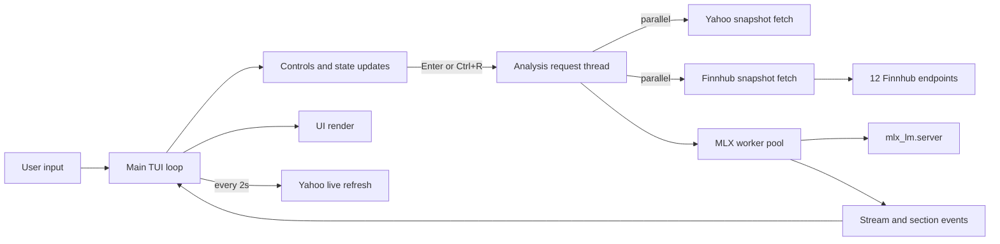

# Rominals

Rominals is a **Rust terminal app** for stock research. It combines:
- live Yahoo quote and chart data,
- multi-endpoint Finnhub datasets,
- local MLX worker analysis for macro and micro outlook.

## Architecture



**Parallelism summary**
- Main thread runs input, render, and event drain.
- Each explicit fetch spawns one analysis thread.
- Inside that thread, Yahoo snapshot fetch and Finnhub snapshot fetch run in parallel.
- MLX analysis runs with a worker pool (`ROMINALS_MLX_PARALLEL_WORKERS`, default `2`, clamped to max `2`).

For the full detailed architecture and threading map, see [`docs/ARCHITECTURE.md`](docs/ARCHITECTURE.md).

## Quick start

```bash
cd backend_rominals
python3 -m pip install mlx-lm
cargo run --release
```

Start with a symbol:

```bash
cargo run --release -- AAPL
```

## Minimal configuration

```bash
export ROMINALS_FINNHUB_API_KEY=your_finnhub_key_here
export ROMINALS_MLX_MODEL=mlx-community/Qwen3.5-4B-MLX-4bit
export ROMINALS_MLX_PARALLEL_WORKERS=2
export ROMINALS_COMP_TICKER=MSFT
```

- `ROMINALS_FINNHUB_API_KEY` (or `FINNHUB_API_KEY`) enables Finnhub.
- `ROMINALS_COMP_TICKER` is optional and adds comparison context.

## Controls

- `Enter`: fetch ticker and run analysis pipeline
- `Ctrl+R`: refresh current ticker and rerun analysis
- `Tab` / `Shift+Tab` / `←` / `→`: switch Yahoo and Finnhub tabs
- `[` / `]`: cycle range or dataset (depending on active tab)
- `Esc` / `Ctrl+C` / `Ctrl+Q`: quit

## Project map

```text
backend_rominals/src/main.rs          entrypoint
backend_rominals/src/tui/             tui loop, state, controls, rendering
backend_rominals/src/api/yahoo.rs     yahoo client and candle parsing
backend_rominals/src/api/finnhub.rs   finnhub client and dataset/context build
backend_rominals/src/api/mlx.rs       mlx server lifecycle and worker pipeline
backend_rominals/scripts/             mlx helper scripts
```