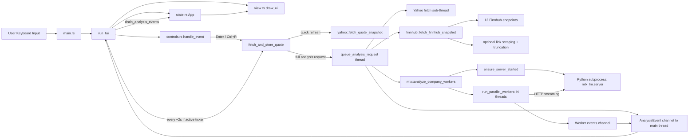
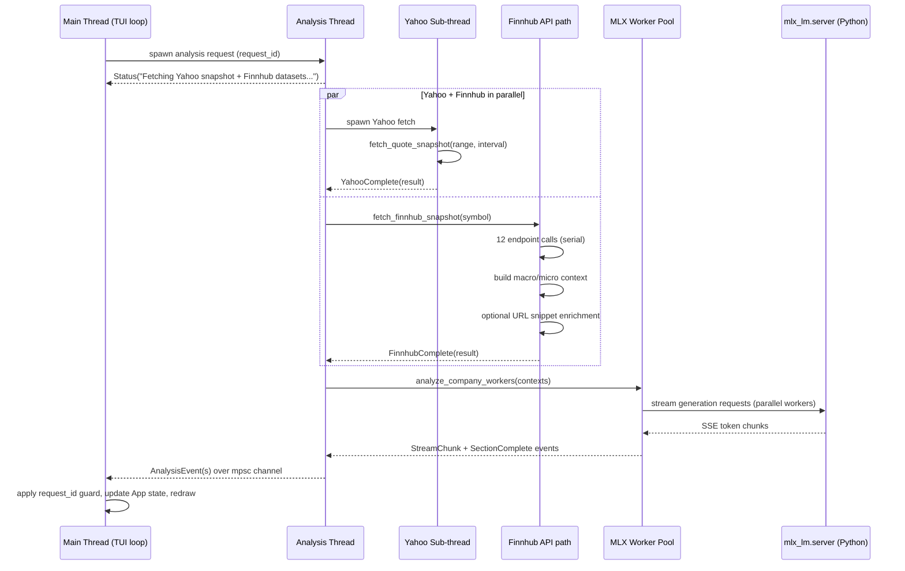

# Rominals Architecture (End-to-End)

This project is a **Rust terminal application** (`backend_rominals`) that combines:

- live Yahoo market data,
- multi-endpoint Finnhub datasets,
- local MLX worker analysis.

It also includes **Python helper scripts** in `backend_rominals/scripts/` for MLX streaming and URL-read experiments.

## Repository layout

```text
rominals/
├── backend_rominals/
│   ├── src/
│   │   ├── main.rs                # CLI arg parsing + TUI entrypoint
│   │   ├── tui/
│   │   │   ├── mod.rs             # app loop, event handling, threading, orchestration
│   │   │   ├── state.rs           # central App state model
│   │   │   ├── controls.rs        # keyboard controls and ticker normalization
│   │   │   └── view.rs            # ratatui rendering (Yahoo/Finnhub)
│   │   └── api/
│   │       ├── yahoo.rs           # Yahoo fetch + candle parsing + analysis context
│   │       ├── finnhub.rs         # Finnhub client + 12 datasets + scoped context
│   │       └── mlx.rs             # MLX server lifecycle + parallel worker generation
│   └── scripts/
│       ├── mlx_stream_test.py     # direct token streaming test
│       └── mlx_link_read_test.py  # URL reading behavior check
└── docs/
    └── notes/                     # research/work logs
```

## Runtime architecture (component view)



## Threading and parallelism map

| Execution unit                     | Type                                       | Spawned from             | Runs what                                                                               | Parallel behavior                    |
| ---------------------------------- | ------------------------------------------ | ------------------------ | --------------------------------------------------------------------------------------- | ------------------------------------ |
| TUI loop                           | Main OS thread                             | Process start            | Input polling, drawing, periodic Yahoo stream refresh, event draining                   | Single-threaded loop                 |
| MLX preload thread (optional)      | Rust thread                                | `queue_model_preload`    | Starts/warms local `mlx_lm.server` when app starts with no initial ticker               | Runs in background once              |
| Analysis request thread            | Rust thread per explicit fetch             | `queue_analysis_request` | Orchestrates Yahoo+Finnhub fetch, then MLX analysis workers                             | One per explicit analysis trigger    |
| Yahoo sub-thread (inside analysis) | Rust thread                                | Analysis thread          | Fetches Yahoo snapshot concurrently                                                     | Runs in parallel with Finnhub fetch  |
| Finnhub fetch path                 | Analysis thread itself                     | Analysis thread          | Calls 12 Finnhub endpoints, builds macro/micro context, optional URL snippet extraction | Sequential in current implementation |
| MLX worker pool                    | 1..N Rust threads (`N` clamped, default 2) | `run_parallel_workers`   | Generates section outputs (Macro/Micro), streams chunks                                 | Workers run concurrently             |
| MLX server                         | Python subprocess                          | `ensure_server_started`  | Hosts local HTTP inference server                                                       | Shared by all workers; loaded once   |

## Per-request execution timeline (explicit analysis fetch)



## State and safety mechanics

- `App` in `tui/state.rs` is the single UI state store (ticker, quote, candles, Finnhub datasets, statuses, errors, live 10s points).
- `analysis_request_id` prevents stale/background thread events from older requests from mutating current UI state.
- Yahoo live stream points are pruned to a rolling 10-second window.
- Finnhub dataset errors are preserved per dataset (`is_error`) so partial failures still render.

## Current UI surface vs internal pipeline

- Visible tabs are **Yahoo** and **Finnhub**.
- MLX worker output is still produced in the pipeline and tracked in app state, but the tab selector currently renders only Yahoo/Finnhub in the visible tab bar.
